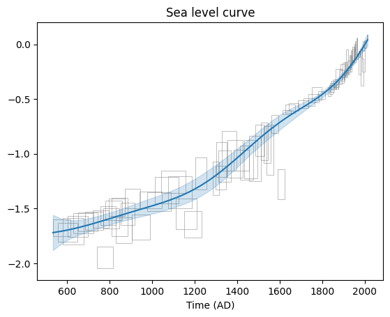

# EIV IGP

My implementation of the [EIV IGP model](https://arxiv.org/pdf/1312.6761#page=12.24) in numpyro/JAX. Used for calculating bayesian estimates for rates of sea level change. The rates are integrated to produce the sea level curves. The [original code](https://github.com/ncahill89/EIV_IGP) was implemented in R/JAGS.

    
    

---

## Features

- 🚀 Enables running MCMC on the GPU
- ⚡ Supports SVI estimates for extremely fast posterior inference
- 🐍 Clean, pythonic interface
- 🧠 Easy to understand codebase (my biased opinion)

## Setup and Usage

- Make sure you have [uv](https://docs.astral.sh/uv/) installed on your system.
- Update `main.py` to point to your data file.
- Run `uv run main.py` in your terminal.

This will run the full EIV IGP model on your data with 2 MCMC chains in parallel.

> If you want to include a GIA rate, change the `gia_rate` argument in the `data.preprocess` call.

To have a quick look at the workflow and some figures, look at the `./example.ipynb` notebook. It has other useful examples - data processing, MCMC, and SVI estimates.

## Benchmarks

On my M2 pro chip, CPU performance on a single chain with the default NYC dataset takes **~6 min**. The same thing takes **~20 min** in the original code.

# Screenshots

Data plotting

Sea level curve

Sea level rate

Model render

